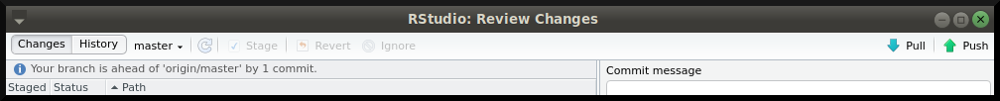

```{r setup, include = FALSE}
library(magrittr) # pipe %>%
library(psych)    # describe()
library(knitr)    # kable()
```

# Good reads

I started by showing two online sources that I found particularly instructive:

- [Hadley Wickam](http://r-pkgs.had.co.nz/git.html)'s tutorial is very cleary written. Take a small hour to go through it; it pays off _very_ quickly!
- [Happy Git with R](https://happygitwithr.com/) was a nice surprise from Google (thanks G!). Very useful to set things up and run some basics. As you progress the reading becomes increasingly thick, so feel free to stop at a point where you feel it's going over your head (this happens to me all the time, don't feel embarrassed).

# Set up your system
This is what you'll need:

- Install [R](https://cran.r-project.org).
- Install [RStudio](https://rstudio.com).
- Install [Git](https://git-scm.com).
- Set up the SSH keys (see [Happy Git with R, section 11](https://happygitwithr.com/ssh-keys.html)). This will save you time and patience by not typing your credentials _ad nauseam_ each time you push things to GitHub.

Now open RStudio. Make sure it has access to R: Your console (low-left corner) should look like \autoref{console}.
```{r, fig.align = "center", out.width = "70%", echo = FALSE, fig.cap = "\\label{console}Console showing R."}

```

Is Git installed and can RStudio find it? Check it (\autoref{is_git_there}).
```{r, fig.align = "center", out.width = "70%", echo = FALSE, fig.cap = "\\label{is_git_there}Are you there, Git?"}

```

Then, set up Git initially. You only do this _once_ per computer. In RStudio, go to `Tools > Shell` and add your name and email using the two commands below:
```
git config --global user.name "YOUR FULL NAME"
git config --global user.email "YOUR EMAIL ADDRESS"
```
Then test whether it worked out (\autoref{git_setup}).
```{r, fig.align = "center", out.width = "70%", echo = FALSE, fig.cap = "\\label{git_setup}Initial Git setup."}
include_graphics("images/git_setup.png")
```

Did you set up the SSH keys correctly? You can quickly check it by going to `Tools > Global Options > Git/SVN` and make sure that the last field, `SSH RSA key`, is filled in (\autoref{SSH}). Also, remember to copy the public key to GitHub via the browser!
```{r, fig.align = "center", out.width = "70%", echo = FALSE, fig.cap = "\\label{SSH}SSH keys."}

```

Finally, and if not done yet, create a [GitHub account](https://github.com/). Remember to use the same email as the one you used above when setting up Git.

Phew! At this point you are _good ot go_!!

# Create a new repository in GitHub

I always create a new repository in GitHub first and then bring it to RStudio (the other way around is also possible but I don't usually do that). So login into GitHub, press on `Repositories` on the top panel, and then press the green `New` button on the top-right (\autoref{github_new_repo}).
```{r, fig.align = "center", out.width = "90%", echo = FALSE, fig.cap = "\\label{github_new_repo}Create a new repository in GitHub."}

```
Here, fill in the name for the repository under `Repository name` (in our workshop I used `reproTea`) and add a small description under `Description`. Choose whether the repository should be public or private. Finally, do check the option to initialize the repository with a README. When you are done, press the green `Create repository` button. See \autoref{github_create_repo}.
```{r, fig.align = "center", out.width = "90%", echo = FALSE, fig.cap = "\\label{github_create_repo}Details in creating a new repository in GitHub."}

```

The project is now created in GitHub. You will see something akin to \autoref{github_repo_view}, but yours should only show the `README` file whereas mine shows all the files that we created throughout the workshop.
```{r, fig.align = "center", out.width = "90%", echo = FALSE, fig.cap = "\\label{github_repo_view}Repository page on GitHub."}

```

# Clone the repository

Now you can _clone_ the project onto your computer. To do that, press the green button called `Clone or download` (see \autoref{github_repo_view}) and copy the URL under the `Use SSH` option (at this point I am assuming you set up the SSH keys correctly).

Next, go to RStudio (top-left menu) and click on `File > New project...`. In the `New Project` window, choose `Version Control`. In the `New project` window, choose `Git`. Finally, paste the URL that you copied from GitHub into the first field called `Repository URL`. Observe that by doing that the second field (`Project directory name`) is filled out automagically. Finally, make note of the location on your disk of this repository by looking at the last field called `Create project as subdirectory of` (change this location if desired via the `Browse` button). Finally, press `Create Project` (\autoref{git_clone}).
```{r, fig.align = "center", out.width = "70%", echo = FALSE, fig.cap = "\\label{git_clone}Import GitHub repository into RStudio."}
include_graphics("images/clone_git.png")
```

# Work on your project
Now it's time to get your hands dirty. Work on whatever files you want. Whatever files you create within RStudio (.R, .Rmd, .tex, .py, etc.) are automatically saved in the correct working directory (check the low-right corner in RStudio under the `Files ` tab; my working directory is  `Home/Documents/My GitHub/reproTea`, see \autoref{git_clone}). As soon as a file in the working directory is added or modified, Git makes notice of it right away. You can see that by looking at the right-top panel of RStudio, under the Git tab. For instance, as I type these notes, I created an RMarkdown file called `Summary_Workshop.Rmd`. It knits into a PDF file with the same name. And, all the images you see in this document are screenshots that I placed inside a folder called `images`. I still didn't commit these changes, so Git is listing these files as being new or having been updated (\autoref{rstudio_git_changes}).
```{r, fig.align = "center", out.width = "90%", echo = FALSE, fig.cap = "\\label{rstudio_git_changes}Git in RStudio keeping track of the files that suffered changes (top-right)."}
include_graphics("images/rstudio_git_changes.png")
```

In case you work on files outside RStudio, _just make sure to save them all in the working directory_. RStudio will show all such files (low-right corner in RStudio under the `Files ` tab), and Git will also notice them (right-top panel of RStudio, under the Git tab). So, feel free to e.g. use Jasp on a data file and save all files, or write a .docx file, or whatever. All such files are Git'able.

# Stage, commit, and push
## Stage
Now let's use Git (we still haven't, by the way). Please focus on the right-top panel of RStudio, under the Git tab. To `stage` the files (i.e., to select what files you want to keep track), check them under the `Staged` column; see \autoref{staged}. In case you have a lot of files, try doing `Ctrl+A` to select all files at once and then check-mark one of them; all will be checked in one go.
```{r, fig.align = "center", out.width = "90%", echo = FALSE, fig.cap = "\\label{staged}Staged files in Git."}

```

## Commit
Next, press the `Commit` button (\autoref{staged}); a new window opens (\autoref{commit}). Here, you can see the changes that the files suffered. This at least works for text files like the .Rmd that I am typing on now (it won't work for .png images, for instance). Green color means new text, red color means erased text. I typically don't look at this, to be fully honest. Anyway, we will now _commit_ this version of the repository. In wording, we will create a snapshot _in your local PC_ of the current status of all files of the repository. I need to stress this again: This is a _local_ backup of the current state of the project. This will not be seen by GitHub just yet (for that we do need to _push_, see below). Give the commit a sensible short description of what you did. Then press the `Commit` button (\autoref{commit}).
```{r, fig.align = "center", out.width = "90%", echo = FALSE, fig.cap = "\\label{commit}Commited files, done locally."}

```
Afterwards, you will see that the files version on your PC is now more recent than the version on GitHub. This is what the message `Your branch is ahead of 'origin/master' by 1 commit` means (\autoref{after_commit}).
```{r, fig.align = "center", out.width = "90%", echo = FALSE, fig.cap = "\\label{after_commit}After doing the commit."}

```

You can do as many of these (local) commits as you feel like. I suggest you do a commit each time you reach a certain milestone (after finishing a section, or after editing a particular file). The commits don't take a lot of space, and they will keep a nice story of the development of the files.

Whenever you are ready to upload all the commits to Github, you will then use the `push` option.

## Push
Simply press the `push` button, to be seen on the right-end of \autoref{after_commit}. Because we set up the SSH keys, you won't need to fill in the username and password at this point. Just wait a few seconds and it will be over (\autoref{push}). Then you can press the `Close` button.
```{r, fig.align = "center", out.width = "90%", echo = FALSE, fig.cap = "\\label{push}Pushing the changes to GitHub."}

```

And now, go back to GitHub and admire in wonder! See \autoref{github_after}.
```{r, fig.align = "center", out.width = "90%", echo = FALSE, fig.cap = "\\label{github_after}GitHub is now up to speed. In my case, see the files associated to the commit called \`First version of summary notes {(}Summary\\_Workshop.Rmd{)}\'."}

```

# Final advice
I suggest that at the end of each working session you always commit and push to Github.

Then, whenever you open RStudio and start working again, you always start by _pulling_ the latest version from GitHub. Just go to the right-top panel of RStudio, under the Git tab, and press the `Pull` button (the button is to be seen, e.g., in \autoref{rstudio_git_changes}). I do this all the time because I work on different computers (in my office, laptop, home desktop). By keeping the latest version in GitHub, I can resume work on the latest version from any of my machines, without worries of mismatch of versions. Plus, if any of my computers dies, the code is all safe in GitHub!

# Request
Please let me know ([j.n.tendeiro@rug.nl](<mailto:j.n.tendeiro@rug.nl>)) whether this `manual' worked for you; feedback is appreciated. In case it did not work, do not despair: You can email me and perhaps together we can crack that nut!


